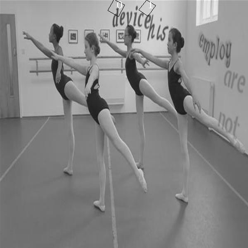

**FCRN文本检测实验记录**

一、FCRN简介
============

FCRN: Fully-Convolutional Regression Network (全卷积回归网络)，出自VGG 实验室这篇 CVPR2016的Paper：[*Synthetic Data for Text Localisation in Natural Images*](http://www.robots.ox.ac.uk/%7Evgg/data/scenetext/)，在ICDAR 2013上的F-measure 达到了84.2%。该论文主要做了两方面的工作：1）数据合成；2）文本检测。

本文的网络结构受启发于VGG-16，网络结构如下:

  **layers**           **params**
  -------------------- ------------------------------------------------------------
  Convolution - ReLU   num\_filters: 64, kernel size: 5×5, stride: 1, padding: 2
  Max Pooling          kernel size: 2×2
  Convolution - ReLU   num\_filters: 128, kernel size: 5×5, stride: 1, padding: 2
  Max Pooling          kernel size: 2×2
  Convolution - ReLU   num\_filters: 128, kernel size: 3×3, stride: 1, padding: 1
  Convolution - ReLU   num\_filters: 128, kernel size: 3×3, stride: 1, padding: 1
  Max Pooling          kernel size: 2×2
  Convolution - ReLU   num\_filters: 256, kernel size: 3×3, stride: 1, padding: 1
  Convolution - ReLU   num\_filters: 256, kernel size: 3×3, stride: 1, padding: 1
  Max Pooling          kernel size: 2×2
  Convolution - ReLU   num\_filters: 512, kernel size: 3×3, stride: 1, padding: 1
  Convolution - ReLU   num\_filters: 512, kernel size: 3×3, stride: 1, padding: 1
  Convolution - ReLU   num\_filters: 512, kernel size: 5×5, stride: 1, padding: 2
  Convolution - ReLU   num\_filters: 7, kernel size: 5×5, stride: 1, padding: 2
  Max Pooling          kernel size: 2×2

输入图像大小为512\*512，经过10个卷积层+4个迟化层，得到7\*16\*16大小的数据，其中7代表（dx,dy,dw,dx,cos,sin,confidence）,dx、dy是proposal与Ground Truth中心点的偏移量，dw、dy是proposal与Ground Truth的尺度缩放比例，cos、sin用来表示矩形的倾斜角度，confidence是置信度。16\*16是将原图（512\*512）经过4个迟化层（512/(2\^4))）得到的。

**参考资料：**

在线demo：[*http://www.robots.ox.ac.uk/\~vgg/data/scenetext*](http://www.robots.ox.ac.uk/~vgg/data/scenetext)/

论文解释：[*http://blog.csdn.net/u010167269/article/details/52389676*](http://blog.csdn.net/u010167269/article/details/52389676)

训练代码：[*https://github.com/Jayhello/textbox\_proposals\_fcrn*](https://github.com/Jayhello/textbox_proposals_fcrn)

数据合成代码：[*https://github.com/ankush-me/SynthText*](https://github.com/ankush-me/SynthText)

**备注**：作者目前只公布了数据合成代码，训练代码是别的人公布的，通过在github上看论文作者与写训练代码作者的交流，发现训练代码写的还不完整；并且论文作者好多地方在论文中也没有说清，比如bounding box的个数，loss的计算方法等。

二、FCRN训练
============

1.训练环境的搭建
----------------

1）使用100机器上容器synthText\_train\_zj；

2）由于训练代码是基于keras框架开发，使用theano后端，keras默认的后端是tensorflow，找到\~/.keras/keras.json文件，手动修改"image\_dim\_ordering": "th", "backend": "theano"；同时theano需要升版本；

2.制作数据集
------------

1）41G的合成数据集下载地址：[*http://www.robots.ox.ac.uk/\~vgg/data/scenetext/*](http://www.robots.ox.ac.uk/~vgg/data/scenetext/)

下载得到的数据集大小是37.5G，数据集文件名synthText

2）synthText文件夹包含图片+标签（gt.mat），gt.mat包含每个图片对应文本的四个点坐标（wordBB）、文本名称、每个字符的四个点坐标以及字符名称等信息；

3）根据图片及对应文本标签信息，制作成训练代码需要的7\*16\*16的标签数据，具体如何制作将在后面制作数据集中说明。

4）跑制作数据集代码：

python build\_dataset.py /notebooks/datasets/data/str/SynthText ../h5

37.5G的合成数据集 制作成训练代码需要的数据形式

5）修改后的代码：/dataTwo/zhangjing/ocr/synthText\_FRCN/textbox\_proposals\_fcrn-master/build\_dataset\_ys.py

3.训练模型
----------

使用gpu跑训练代码：THEANO\_FLAGS=device=gpu1,floatX=float32 python train\_model.py

**备注：**

1)  gpu1对应100服务器上的gpu0

2)  修改训练、预测数据集路径等

修改后的代码：/dataTwo/zhangjing/ocr/synthText\_FRCN/textbox\_proposals\_fcrn-master/train\_model\_predict\_zj.py

三、FCRN踩过的坑
================

1.制作数据集
------------

1）存放图片对应文本标签的gt.mat，采样h5py取出报错，修改成scipy的方式读取；

2）代码中(x, y, w, h, cos, sin,confidence)有些地方的cos、sin位置写反了，将其改正；

3）calc\_pose()函数制作斜矩形标签时，w、h计算有误，修改成正确的斜矩形w、h计算；

4）训练需要的图片文本标签是根据bounding box regression原理制作的，关于bounding box regression原理可参考

[*http://blog.csdn.net/u013832707/article/details/53641055*](http://blog.csdn.net/u013832707/article/details/53641055)，而代码中则不是按照真正的bounding box regression原理做的；

根据R-CNN论文给出的如下公式，经过Ground Truth和Proposal计算得到真正需要的偏移量（tx，ty）和缩放尺寸（tw, th）。

![C:\\Users\\zhangjing1\\AppData\\Roaming\\Tencent\\Users\\463261929\\QQ\\WinTemp\\RichOle\\R\]B@0\`R\_6MG@6ZEYUK(KHPL.png](FCRN算法总结/media/image1.png){width="2.0208333333333335in" height="1.6145833333333333in"}

其中(Px,Py,Pw,Ph)是将原图像（512\*512）分割成16\*16个格子中每个格子的中心点坐标及格子的宽高；（Gx,Gy,Gw,Gh）是图片中文本区域的中心坐标及宽高；（Gx,Gy,Gw,Gh）的中心点坐标落入(Px,Py,Pw,Ph)网格，才根据上面公式得到我们训练需要的文本标签（tx, ty, tw, th）。

同时，FCRN的bounding box个数等于1，宽高比例为1：1；而yolo v1的bounding box个数等于2，yolo v2的bounding box等于5， 宽高比例为1:1、1:2等情况。这点也是可能存在问题的地方。

5）FCRN中confidence网格中有物体则为1，没物体则为0,对于下图的情况会有问题；而在yolo中confidence=P(object)\*IOU。其中，若bounding box包含物体，则P(object) = 1；否则P(object) = 0。IOU(intersection over union)为预测bounding box与物体真实区域的交集面积。

3个红色区域的中心点都落入蓝色网格中，如果给这三个红色区域的confidence都设为1,必然会有问题，所以真正的confidence应该是P(object)\*IOU,IOU是该网格与红色区域的交并比。

2.训练网络模型
--------------

1）训练样本用完训练就结束，修改exemplar\_generator()代码，每个epoch完就重新加载一次样本数据。

2）训练过程中loss、accuracy都在下降，最后发现keras框架的accuracy计算是针对识别的，accuracy指标不可用，所以观察训练结果时可忽略该指标，正确的情况是loss在下降、accuracy在上升。

3）FCRN训练时的标签是按照斜矩形做的，而在计算loss时还按照正矩形计算。按照yolo loss的计算方法修改loss代码，new loss=坐标loss+

confidence loss。

坐标loss就是预测斜矩形四点坐标与真实斜矩形四点坐标差的绝对值，考虑到位置相关误差对网络loss的贡献值不同，在计算坐标loss时，乘以系数5来修正坐标loss，根据（x, y, w, h, cos, sin）可计算得到斜矩形的四个点坐标。

confidence loss就是预测confidence与真实的confidence差的绝对值，考虑到包含物体的格子与不包含物体的格子二者的confidence对网络loss的贡献值不同的。若采用相同的权值，那么不包含物体的格子的confidence值近似为0，变相放大了包含物体的格子的confidence误差在计算网络参数梯度时的影响。为了解决这个问题，在计算confidence loss时，对于不包含物体的格子的confidence乘以一个修正系数0.5。

**备注：**在整理该文档时，才发现之前修改的loss还存在一个问题，包含物体的格子的confidence为1，不包含物体的格子的confidence为0；而不是通过P(object)\*IOU 来计算confidence的，其中这里的IOU应该是斜矩形的IOU。

4.  FCRN训练代码只有训练部分，添加预测部分代码；

5.  添加预测结果后处理代码：

> 通过画四条边来画斜矩形，但是需要注意的是，网络输出的是（dx,dy，dw,dh），需要将该参数根据bounding box原理转换回去；
>
> nms（非极大值抑制）处理：主要目的是为了消除多余的框，找到最佳的物体检测的位置。遵循的原则是：如果两个区域的IOU&lt; threshold,两个区域都保留；如果两个区域的IOU&gt;= threshold，保留confidence大的那个区域。在nms处理时，主要的工作难点在于斜矩形IOU的计算，而斜矩形IOU计算的难点在于判断点是否在斜矩形内，可参考
>
> [*http://blog.csdn.net/liangzhaoyang1/article/details/51090625*](http://blog.csdn.net/liangzhaoyang1/article/details/51090625)编写点是否在斜矩形内。

6）修改完成后重新训练，使用训练样本预测的结果还是很差，结果如下图所示：

> {width="3.6875in" height="3.03125in"}

3.yolo基础上训练FCRN
--------------------

由于作者论文上好多地方没有说清，修改了那么多地方也没能达到想要的效果。根据作者在论文中说到FCRN网络结构是在yolo的基础上改的，所以就想试试用FCRN的网络结构替换yolo的，看看是否可用。

yolo的下载地址：[*https://github.com/pjreddie/darknet*](https://github.com/pjreddie/darknet)

yolo是在darknet网络框架上开发的，yolo v1的原理可参考：

[*https://zhuanlan.zhihu.com/p/25236464*](https://zhuanlan.zhihu.com/p/25236464)

yolo 训练：[*http://www.itdadao.com/articles/c15a1240673p0.html*](http://www.itdadao.com/articles/c15a1240673p0.html)

1)  编译环境

> cd darknet-master
>
> make clean
>
> make –j16

**备注**：如果使用GPU，可修改makefile文件中的GPU=1 CUDNN=1，重新编译。

2） 修改cfg/yolo.cfg文件，将yolo v2的网络结构替换成FCRN的，并且修改classes=1，batch=8，batch数值不能太大，不然在用GPU跑时会报如下错误：

CUDA Error: out of memory

darknet: ./src/cuda.c:36: check\_error: Assertion \`0' failed.

Aborted (core dumped)

修改后的代码：/dataTwo/zhangjing/ocr/darknet-master/cfg/yolo-fcrn.cfg

3）修改cfg/voc.data文件中的样本路径以及类别名称等，如下：

classes= 1

train = /notebooks/zhangjing/ocr/darknet-master/data/train.txt //存放图片的绝对路径

valid = /notebooks/zhangjing/ocr/darknet-master/data/test.txt

names = data/voc-fcrn.names

backup = backup

修改后的代码：/dataTwo/zhangjing/ocr/darknet-master/cfg/voc-fcrn.cfg

**备注：**

图片、标签路径如下：

图片：/notebooks/yushan/darknet-master/textdata/images/kathmandu\_147\_28.jpg

标签：/notebooks/yushan/darknet-master/textdata/labels/kathmandu\_147\_28.txt

yolo不要专门指定labels的路径，因为代码可根据图片的路径能找到相应标签的路径，标签txt文件名称与图片jpg名称相同。

4）训练：./darknet detector train ./cfg/voc-fcrn.data ./cfg/yolo-fcrn.cfg | tee train.log

5）测试：./darknet **detect** cfg/yolo-fcrn.cfg cfg/yolo-fcrn.weights data/dog.jpg -thresh 0.5

6)使用验证集评估模型：./darknet detector valid cfg/voc-fcrn.data cfg/yolo-fcrn.cfg backup/yolo-fcrn\_70000.weights

7\) 查看召回率： ./darknet detector recall cfg/voc-fcrn.data cfg/yolo-fcrn.cfg backup/yolo-fcrn\_70000.weights

**备注:** 训练模型时，loss一直不收敛，改小学习率、policy=inv、batch=8都不能使loss收敛。同时在测试训练图片时，测试结果的confidence都是50%（这点很奇怪）。Batch应该在改大的试试，由于GPU显存原因，这个是个极限。
